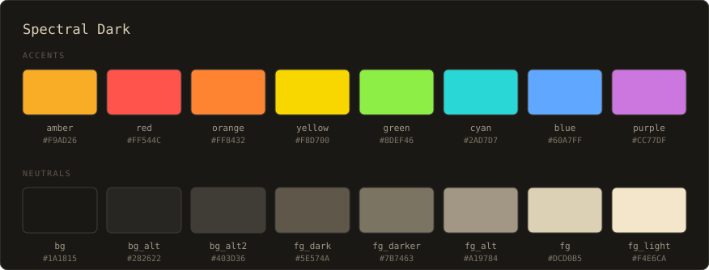
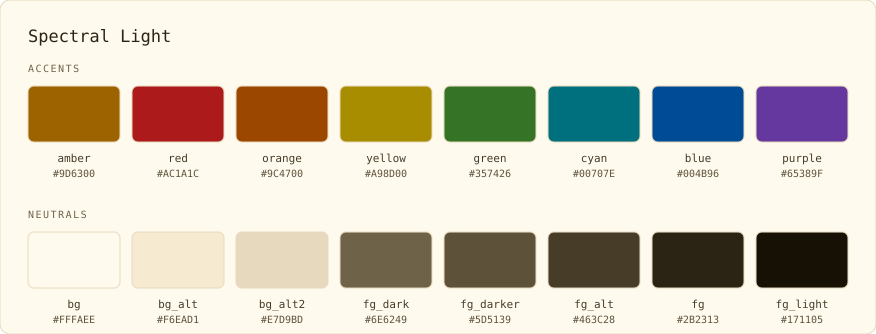
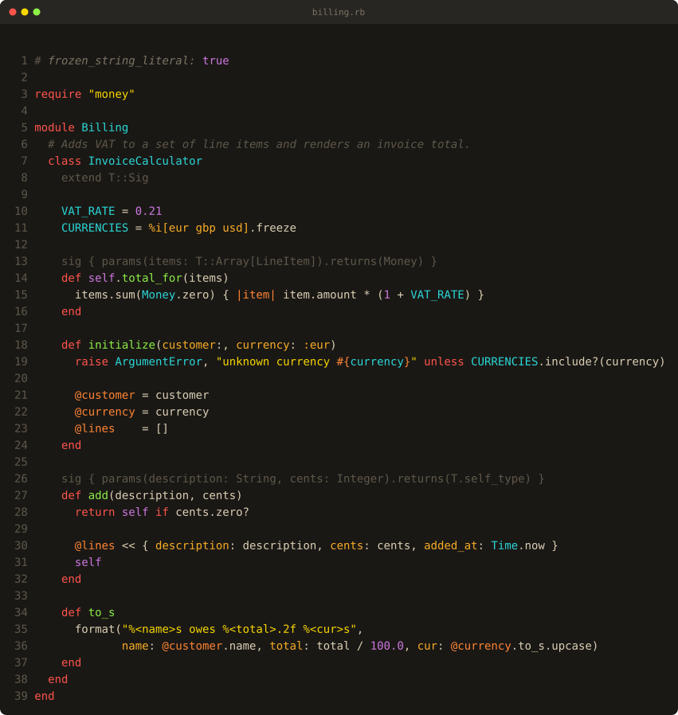
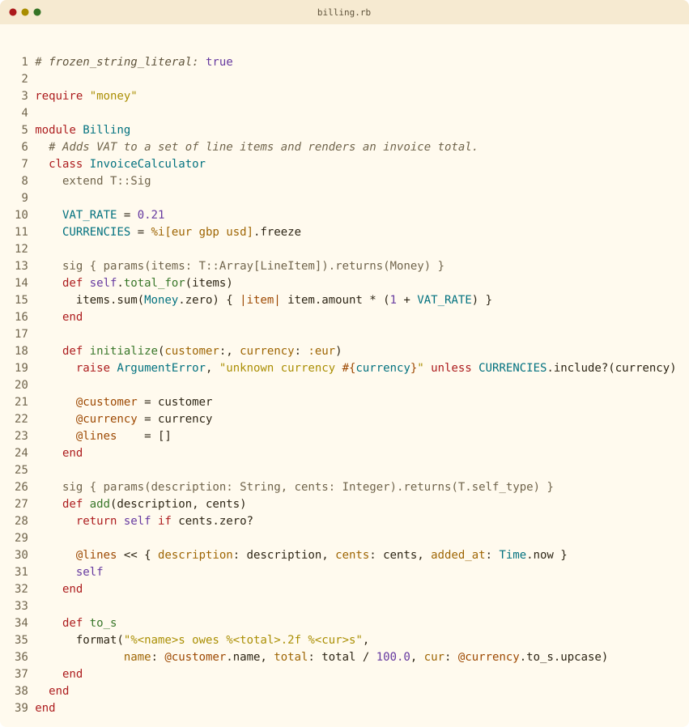
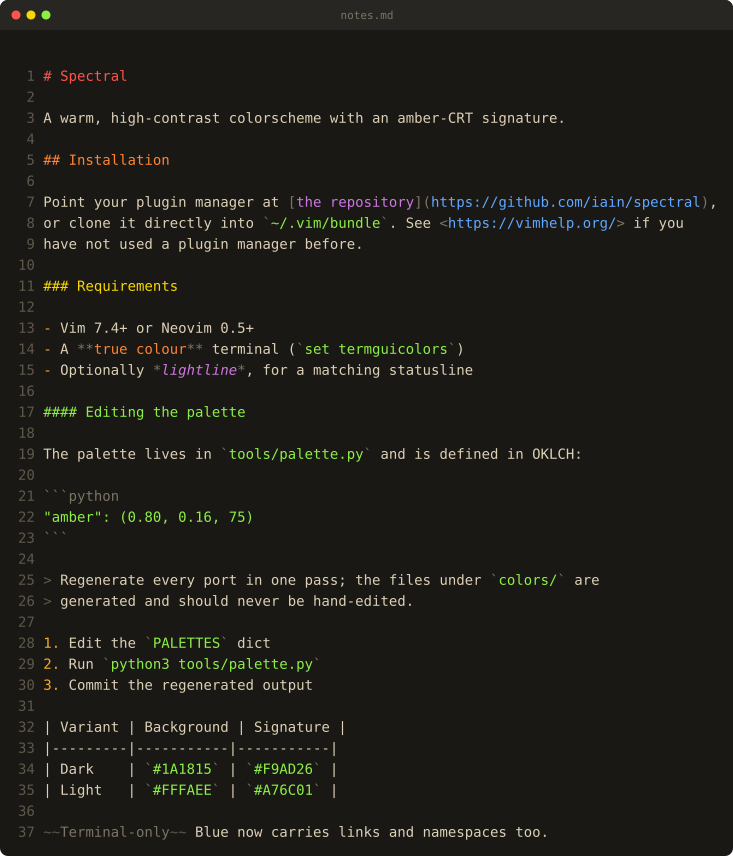
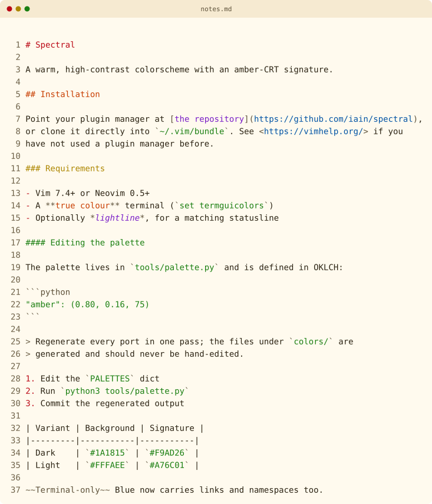
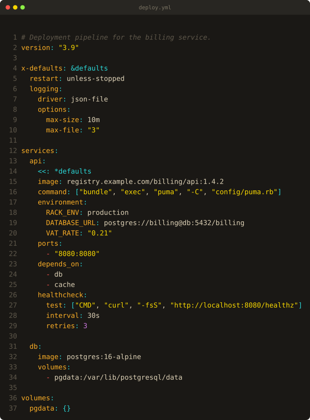
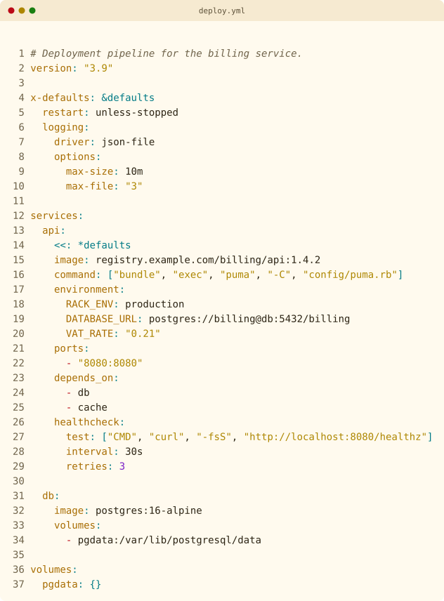

# Spectral

A warm, high-contrast colorscheme with an amber-CRT signature, in dark and
light variants.

- **Spectral Dark** — amber phosphor on OLED black
- **Spectral Light** — warm cream paper, same amber signature

Every target is generated from one palette definition, so the colors match
across your editor, your terminal, and everything else.





Ruby with Sorbet type signatures, Markdown headings, and YAML keys in amber:

| Dark | Light |
|------|-------|
| <a href="https://raw.githubusercontent.com/iain/spectral/main/screenshots/billing-dark.svg"></a> | <a href="https://raw.githubusercontent.com/iain/spectral/main/screenshots/billing-light.svg"></a> |
| <a href="https://raw.githubusercontent.com/iain/spectral/main/screenshots/notes-dark.svg"></a> | <a href="https://raw.githubusercontent.com/iain/spectral/main/screenshots/notes-light.svg"></a> |
| <a href="https://raw.githubusercontent.com/iain/spectral/main/screenshots/deploy-dark.svg"></a> | <a href="https://raw.githubusercontent.com/iain/spectral/main/screenshots/deploy-light.svg"></a> |

Click through for the full-size render. Python samples are in
[`screenshots/`](screenshots/).

## Where it runs

| Application  | What ships                                              |
|--------------|---------------------------------------------------------|
| Vim / Neovim | colorscheme, lightline theme, Sorbet syntax plugin      |
| VS Code      | extension — workbench, TextMate scopes, semantic tokens |
| Ghostty      | two themes, plus an install script                      |
| iTerm2       | two presets, plus a profile sync script                 |
| Mattermost   | two custom themes                                       |

## Vim and Neovim

With [vim-plug](https://github.com/junegunn/vim-plug):

```vim
Plug 'iain/spectral'
```

With Pathogen, clone into `~/.vim/bundle`. Manually, copy `colors/` into
`~/.vim/colors` (Vim) or `~/.config/nvim/colors` (Neovim). Then add to your
`.vimrc` or `init.vim`:

```vim
set termguicolors
colorscheme spectral        " picks the variant matching &background
```

`spectral-dark` and `spectral-light` force a variant. Requires Vim 7.4+ or
Neovim 0.5+, and a true-color terminal.

**Languages** — Ruby (including Sorbet), Python, JavaScript, TypeScript, Go,
HTML, CSS, Markdown, JSON, YAML, TOML, XML, and Vim script.

**Plugins** — GitGutter, Signify, fugitive, NERDTree, netrw, ALE, CoC, fzf,
CtrlP, Telescope, Startify, and vim-which-key.

**Neovim** — Treesitter (0.8+), covering both the legacy `@text.*` captures and
the `@markup.*` names Neovim 0.10 renamed them to; LSP diagnostics, references,
code lens, inlay hints and signature help (0.5+); semantic tokens (0.9+);
floating windows, WinBar and WinSeparator.

### Statusline

A matching [lightline.vim](https://github.com/itchyny/lightline.vim) theme
ships with the colorscheme. Once Spectral is on your runtimepath:

```vim
let g:lightline = { 'colorscheme': 'spectral' }
```

It follows `&background` once lightline reloads.

### Sorbet type signatures

`plugin/sorbet.vim` loads automatically for Ruby files and dims `sig` blocks,
`T::` types and `extend T::Sig`, so signatures recede behind the code they
annotate.

## VS Code

`vscode/` is a self-contained extension covering the workbench, the integrated
terminal's ANSI palette, TextMate scopes, and LSP semantic tokens.

To use it without publishing, link it into your extensions directory and
reload:

```bash
ln -s "$PWD/vscode" ~/.vscode/extensions/spectral
```

To build a `.vsix`:

```bash
cd vscode && npx @vscode/vsce package
```

The mapping departs from the Vim theme in two places, both where the Vim theme
is internally inconsistent:

- **Punctuation** uses `fg_alt`, following the Treesitter captures rather than
  the brighter per-language groups (`jsonBraces`, `cssBraces`).
- **Regular expressions** follow the richer `rubyRegexp*` treatment — cyan
  body, orange escapes, purple character classes — rather than the flat orange
  of `@string.regex`.

Sorbet signatures are not dimmed here; that relies on the syntax regions in
`plugin/sorbet.vim`, which have no TextMate scope to hook.

## Ghostty

`ghostty/spectral-dark` and `ghostty/spectral-light`. Run `ghostty/install.sh`
to symlink them into `${XDG_CONFIG_HOME:-~/.config}/ghostty/themes/`, then
reference them by name:

```
theme = dark:spectral-dark,light:spectral-light
```

Pass `--force` to replace existing files at the destination.

## iTerm2

`iterm2/Spectral Dark.itermcolors` and `iterm2/Spectral Light.itermcolors`.
Import via Settings → Profiles → Colors → Color Presets → Import.

To wire both variants into one profile so iTerm2's automatic dark/light
switching works:

```bash
iterm2/sync.py <path-to-com.googlecode.iterm2.plist> [profile-name]
```

The profile name defaults to `Default`. The script writes the dark preset to
the unsuffixed and `(Dark)` color keys, and the light preset to the `(Light)`
keys.

## Mattermost

`mattermost/spectral-dark.json` and `mattermost/spectral-light.json`. Open
Settings → Display → Theme → Custom Theme, expand "Copy/Paste Theme Colors",
and paste either file. Amber anchors mentions, buttons and the active-channel
border; the team rail is the darkest neutral.

## The palette

Each variant is defined in OKLCH — lightness 0–1, chroma, and hue in degrees.
The accents sit in a roughly equiluminant band, so they feel equally bright
across hues, and the neutrals all share one warm hue at low chroma.

Amber is the signature, and it goes on whatever gives a language its texture:
the element you see constantly. Ruby symbols came first; the rest were picked
one language at a time.

| Language                   | Element                        |
|----------------------------|--------------------------------|
| Ruby                       | symbols                        |
| Python                     | decorators                     |
| YAML, JSON, TOML           | keys                           |
| CSS                        | property names                 |
| JavaScript, TypeScript, Go | object and struct literal keys |
| Markdown                   | list markers                   |

HTML, XML and Vim script have no amber yet: nothing in them is both frequent
and characteristic enough without swamping the file.

### Spectral Dark

| Color             | OKLCH                | Hex       | Usage                          |
|-------------------|----------------------|-----------|--------------------------------|
| Amber (signature) | `0.80 / 0.16 / 75°`  | `#F9AD26` | Symbols, decorators, keys      |
| Red               | `0.68 / 0.22 / 27°`  | `#FF544C` | Keywords, control flow         |
| Orange            | `0.74 / 0.20 / 50°`  | `#FF8432` | Parameters, special characters |
| Yellow            | `0.88 / 0.20 / 98°`  | `#F8D700` | Strings                        |
| Green             | `0.86 / 0.22 / 135°` | `#8DEF46` | Functions, methods             |
| Cyan              | `0.80 / 0.13 / 195°` | `#2AD7D7` | Types, built-in functions      |
| Blue              | `0.72 / 0.18 / 255°` | `#60A7FF` | Links, namespaces              |
| Purple            | `0.70 / 0.17 / 320°` | `#CC77DF` | Constants, numbers, booleans   |

Background `0.21 / 0.006 / 85°` → `#1A1815` · Foreground `0.86 / 0.038 / 85°` → `#DCD0B5`

### Spectral Light

| Color             | OKLCH                 | Hex       | Usage                          |
|-------------------|-----------------------|-----------|--------------------------------|
| Amber (signature) | `0.58 / 0.124 / 72°`  | `#A76C01` | Symbols, decorators, keys      |
| Red               | `0.50 / 0.200 / 27°`  | `#BB0916` | Keywords, control flow         |
| Orange            | `0.56 / 0.183 / 38°`  | `#C83E01` | Parameters, special characters |
| Yellow            | `0.64 / 0.131 / 88°`  | `#AD8600` | Strings                        |
| Green             | `0.52 / 0.166 / 142°` | `#1A7F11` | Functions, methods             |
| Cyan              | `0.53 / 0.091 / 205°` | `#007A85` | Types, built-in functions      |
| Blue              | `0.45 / 0.148 / 255°` | `#0053A4` | Links, namespaces              |
| Purple            | `0.48 / 0.233 / 302°` | `#791DC7` | Constants, numbers, booleans   |

Background `0.985 / 0.020 / 85°` → `#FFFAEE` · Foreground `0.26 / 0.030 / 85°` → `#2B2313`

Where a requested chroma falls outside the sRGB gamut, the generator reduces it
by bisection, preserving L and H, so each hex is the closest representable
color. Some distinctions also depend on the editor: namespaces separate from
types only under Treesitter, LSP or semantic tokens, and fall back to cyan in
Vim's regex syntax.

## Working on the theme

Edit the `PALETTES` dict in `tools/palette.py` and run it to regenerate every
target in one pass:

```bash
python3 tools/palette.py
```

That writes `colors/spectral-*.vim`, `ghostty/spectral-*`,
`iterm2/*.itermcolors`, `mattermost/spectral-*.json`,
`vscode/themes/spectral-*.json`, `vscode/icon.png`,
`screenshots/palette-*.svg`, and
`autoload/lightline/colorscheme/spectral.vim`. All of those are generated — do
not hand-edit them. After regenerating the iTerm2 presets, run
`iterm2/sync.py <plist>` to push them into your own plist.

### Tests

```bash
python3 -m unittest discover -s tools
```

They check the generated output: valid hex everywhere, no TextMate scope
claimed by two entries, and a contrast floor. CI runs them alongside a check
that the generated files match the palette.

### Screenshots

```bash
python3 tools/screenshots.py            # every sample, both variants
python3 tools/screenshots.py billing    # only samples matching a stem
```

Each file in `tools/samples/` is rendered through a real headless Vim and
written to `screenshots/`. The colors come from Vim's own `:TOhtml` rather than
from the palette, so a screenshot reports what the colorscheme actually
resolved each syntax group to.

This needs `vim` on `PATH`, and is not part of the CI drift check: `:TOhtml`
markup shifts between Vim versions, so regenerating on a different Vim produces
spurious diffs. Rerun it by hand when the palette changes. The `palette-*.svg`
cards come from `tools/palette.py` instead, need no Vim, and are drift-checked
like every other generated file.

## License

MIT
